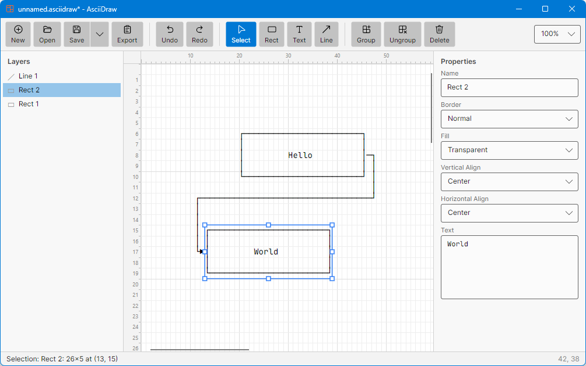

<p align="center">
  
</p>

<h1 align="center">AsciiDraw</h1>

<p align="center">
  Draw diagrams with your mouse. Get plain text back.
</p>

<p align="center">
  <a href="https://asciidraw.puppylab.org">Documentation</a> ·
  <a href="https://github.com/michaelliao/asciidraw/releases/latest">Download</a>
</p>

---

AsciiDraw is a cross-platform desktop app for creating text-based art —
diagrams, flow charts, and layouts made of Unicode box-drawing characters.
Sketch like in any vector editor; export plain text that fits anywhere a
monospace font lives: source code comments, documentation, commit messages,
chat.



```
┌───────────┐
│   Hello   │──────┐
└───────────┘      │
                   ▼
             ┌────────────┐
             │   World    │
             └────────────┘
```

## Features

- **Two simple elements** — rectangles (with text, borders, fills, alignment)
  and orthogonal lines (with arrowheads). Text boxes are just borderless
  rectangles.
- **Smart connectors** — lines snap to eight connection points per rectangle
  and stay attached when shapes move or resize, re-routing with the minimum
  number of segments.
- **Three line weights** — Normal `─`, Bold `━`, and Double `═`, with correct
  junction characters where they cross (`┿ ╪ ╂ ╫ ╬`).
- **Layers & groups** — restack elements by dragging in the layers panel,
  group shapes to move them together.
- **Full editing** — move, resize, multi-select, undo/redo, keyboard nudging,
  zoom.
- **Export anywhere** — copy to clipboard, or save as `.txt`, `.svg`, `.png`.
  The native `.asciidraw` format is readable JSON.
- **Native & portable** — compiled ahead-of-time with no runtime to install,
  for Windows, macOS (Intel & Apple Silicon), and Linux.

## Install

Grab the package for your platform from the
[latest release](https://github.com/michaelliao/asciidraw/releases/latest),
unzip, and run `AsciiDraw`.

## Build from source

Requires the [.NET 10 SDK](https://dotnet.microsoft.com/download):

```sh
git clone https://github.com/michaelliao/asciidraw.git
cd asciidraw
dotnet run
```

Releases are published by the GitHub Actions workflow on `v*` tags, which
builds NativeAOT binaries for all platforms.

## Documentation

The full guide — tools, connection points, style merging, shortcuts — is at
**[asciidraw.puppylab.org](https://asciidraw.puppylab.org)**.

## Tech

Built with [Avalonia](https://avaloniaui.net/) and rendered with the bundled
[Maple Mono](https://github.com/subframe7536/maple-font) typeface, so the
canvas and every export line up character for character.
